### Hello! I'm hect0x7 👋

---

<a href="https://github.com/hect0x7/hect0x7">
  <picture>
    <source media="(prefers-color-scheme: dark)" srcset="picture/stats-dark.svg">
    <source media="(prefers-color-scheme: light)" srcset="picture/stats-light.svg">
    
  </picture>
  
  <picture>
    <source media="(prefers-color-scheme: dark)" srcset="picture/top-langs-dark.svg">
    <source media="(prefers-color-scheme: light)" srcset="picture/top-langs-light.svg">
    
  </picture>
</a>

About me:

- 🔭 I like doing sth that interests me in the open-source community whenever I'm free

- ❤️ I love writing Python the most and pursuing excellent system design

- 📫 How to reach me: [here](https://github.com/hect0x7/hect0x7/issues)

<!--
**hect0x7/hect0x7** is a ✨ _special_ ✨ repository because its `README.md` (this file) appears on your GitHub profile.

Here are some ideas to get you started:

- 🔭 I’m currently working on ...
- 🌱 I’m currently learning ...
- 👯 I’m looking to collaborate on ...
- 🤔 I’m looking for help with ...
- 💬 Ask me about ...
- 📫 How to reach me: ...
- 😄 Pronouns: ...
- ⚡ Fun fact: ...
-->

<picture>
  <source media="(prefers-color-scheme: dark)" srcset="https://raw.githubusercontent.com/hect0x7/hect0x7/output/github-contribution-grid-snake-dark.svg">
  <source media="(prefers-color-scheme: light)" srcset="https://raw.githubusercontent.com/hect0x7/hect0x7/output/github-contribution-grid-snake.svg">
  
</picture>
